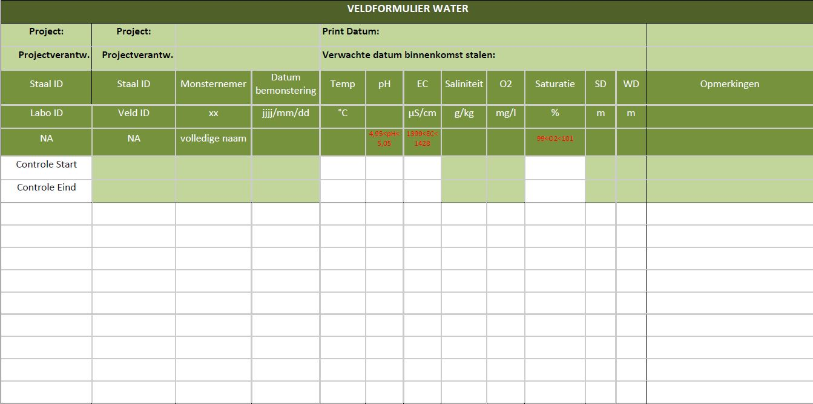

```{=html}
<!--
Instructies bij opmaak van het protocol:

Hieronder vind je de verschillende onderdelen van een protocol.
In de bijhorende losse `Rmd` bestanden vind je een beschrijving wat er bij elk onderdeel vermeld moet worden.
Het is in die bestanden dat je moet editeren.
Niet alle onderdelen zijn altijd van toepassing.
Laat in die gevallen de titel hoofdingen staan en vermeld expliciet "niet van toepassing".
-->
```
```{r setup, include=FALSE}
library(knitr)
opts_chunk$set(
  echo = FALSE,
  eval = TRUE,
  dpi = 300,
  fig.width = 150 / 25.4,
  fig.height = 100 / 25.4,
  out.width = "100%",
  warning = FALSE,
  error = TRUE,
  message = FALSE
)
library(dplyr)
library(purrr)
library(protocolhelper)
library(pander)
panderOptions("table.alignment.default", "left")
metadata <- rmarkdown::metadata
path_to_protocol <- get_path_to_protocol(metadata$protocol_code)
type <- get_protocol_type(metadata$protocol_code, auto_identifier = TRUE)
```

# Metadata {.unnumbered}

```{r metadata-table}
tibble(
  reviewers = metadata[["reviewers"]] |> paste(collapse = ", "),
  documentbeheerder = metadata[["file_manager"]],
  protocolcode = metadata[["protocol_code"]],
  versienummer = metadata[["version_number"]],
  taal = metadata[["language"]],
  projectnaam = metadata[["project_name"]]
) %>%
  kable()
```

```{r results="asis"}
sprintf("Controleer [deze tabel](../%s.html){target=\"_blank\"} om te zien of een meer recente versie beschikbaar is.", type) |> cat() # nolint
```

<!--chapter:end:index.Rmd-->

# Wijzigingen t.o.v. vorige versies

## [2024.10](../2024.10/index.html)

<!--chapter:end:NEWS.md-->

# Wijzigingen vorige versie

Versie 1.0, geen vorige versies.

<!--chapter:end:01_wijzigingen_vorige_versies.Rmd-->

# Afhankelijkheden

Procedures waarnaar in deze procedure verwezen wordt:

-   SOP-007: Ontvangst en beheer van watermonsters door het laboratorium.

-   SPP-117: Abiotische staalname stromende wateren

-   SVP-015: Bioveiligheidsmaatregelen (in opmaak)

-   SVP-112: Veiligheid in en rond water (in opmaak)

-   SVP-113: Bepaling doorzicht waterkolom oppervlaktewater op basis van de secchi-diepte

-   SVP-114: Bemonstering waterkolom oppervlaktewater

-   SVP-115: Veldmeting abiotiek oppervlaktewater met behulp van WTW Multi 3430 veldmeter

Procedures die verwijzen naar deze procedure:

-   SPP-117: Abiotische staalname stromende wateren

<!--chapter:end:02_afhankelijkheden.Rmd-->

# Onderwerp

## Definities en afkortingen

**Mengstaal**: een staal bekomen door het mengen van meerdere deelstalen. De deelstalen worden op verschillende, doorgaans ruimtelijk gespreide, plaatsen binnen eenzelfde staalnamelocatie genomen.

**oppervlaktewater**: al het permanent of op geregelde tijdstippen stilstaande of stromende water op het landoppervlak, aan de landzijde van de basislijn vanaf waar de breedte van de territoriale zee wordt gemeten (DIW 2003).

**Staal of monster:** een portie die geselecteerd wordt uit een grotere hoeveelheid. In dit protocol bestaat het staal steeds uit een hoeveelheid water van de staalnamelocatie.

**Staalnamelocatie** of **steekproefeenheid**: het waterlichaam (poel, vijver, plas ...) waarvan de abiotische karakterisatie wordt beoogd en waarbinnen het staalnamepunt zich bevind.

**Staalnamepunt:** de exacte plaats binnen de staalnamelocatie waarop de abiotische staalname wordt uitgevoerd.

**UPW**: ultrapuur water is sterk gezuiverd water dat vrijwel volledig vrij is van o.a. carbonaat, mangnesium- en calciumionen, organische verbindingen en gassen; het heeft een elketrische geleidbaarheid van ongeveer 0,055 µS/cm bij 25 °C.

## Doelstelling en toepassingsgebied

**Doelstelling**:

Deze procedure beschrijft de staalname en de bepaling van enkele veldkenmerken in stilstaande oppervlaktewateren, met het oog op de bepaling van de fysisch-chemische toestand van de waterkolom. Dit projectprotocol is een overkoepelend protocol waarin voor specifieke werkzaamheden wordt verwezen naar andere protocollen. Dit protocol is specifiek ontworpen voor de monitoring in kader van de meetnetten natuurlijk milieu (Vanderhaeghe et al. 2020).

**Toepassingsgebied**:

Deze gestandaardiseerde procedure kan toegepast worden bij alle typen stilstaande oppervlaktewateren. Voor stromende wateren verwijzen we naar het projectprotocol SPP-117.

<!--chapter:end:03_onderwerp.Rmd-->

# Benodigdheden

Tabel 1 geeft een overzicht van de benodigde apparatuur en materiaal voor het uitvoeren van een abiotische staalname. Onder 4.1 worden een aantal specifieke benodigdheden van verdere uitleg voorzien.

|                                                            |
|:-----------------------------------------------------------|
| **Algemene benodigdheden**                                 |
| staalnameformulier                                         |
| klembord, potlood en slijper                               |
| laarzen, lieslaarzen, waadpak (site-afhankelijk)           |
| latex handschoenen (poederloos)                            |
| plooimeter                                                 |
| fototoestel                                                |
| documentatie lokalisatie staalnamepunt                     |
| relevante protocollen (SVP-113, SVP-114, SVP-115, SPP-116) |

Tabel 1: Checklist benodigd veldmateriaal.

## Materiaal

### Locatieafhankelijke benodigdheden

Afhankelijk van de diepte en aard van de staalnamelocatie en de ligging van het staalnamepunt kunnen laarzen, lieslaarzen, waadpak en in bepaalde gevallen zelfs een boot nodig zijn. Bij werk vanop een boot of bij steile oevers kan een zwemvest en/of reddingstouw aangeraden of verplicht zijn (zie protocol SVP-112: Veiligheid in en rond water).

### Staalnameformulier

Het staalnameformulier (Bijlage 1) kan zowel digitaal als analoog ingevuld worden in het veld. Bij voorkeur wordt tijdens de staalname steeds de analoge versie ingevuld, zodat typfouten of problemen bij het opslaan niet mogelijk zijn en tevens een originele versie wordt bewaard om controle op een later tijdstip mogelijk te maken. Het staalnameformulier wordt duidelijk leesbaar en volledig ingevuld met potlood.

Op het staalnameformulier worden tijdens de abiotische staalname (volgens het voorgelegde protocol) de volgende gegevens ingevuld:

-   code van het staal (= Labo ID);

-   code van de locatie (= Veld ID);

-   staalnemer;

-   datum staalname (jjjj/mm/dd);

-   temperatuur (°C);

-   zuurtegraad (pH) (eq/l);

-   conductiviteit (EC) (in µS/cm bij lage waarden of mS/cm bij hoge waarden);

-   saliniteit (g/kg);

-   opgeloste zuurstof (mg/l);

-   zuurstofverzadiging (%);

-   opmerkingenveld.

<!--chapter:end:04_benodigdheden.Rmd-->

# Werkwijze

## Uitvoering

Alle stappen van het veldprotocol worden hieronder kort omschreven. Voor een gedetailleerde uitleg over specifieke handelingen wordt verwezen naar de deelprotocollen SVP-113, SVP-114 en SVP-115.

### Voorbereiding terreinwerk

Voor de start van de veldcampagne worden de staalnamelocaties in de Aquamorf databank in ArcGIS ingevoerd alsook de staalnamepunten (indien deze vooraf gekend zijn, anders worden deze na de eerste meting ingevoerd). Van elke staalnamelocatie worden ten minste twee overzichtskaarten afgedrukt voor lokalisatie in het veld: één met orthofoto en één met een topografische kaart als achtergrond, steeds met de aanduiding van de staalnamelocatie en -code. De XY-coördinaten van de staalnamelocatie worden ingevoerd in een standaard GPS of in een smartphone-applicatie.

Indien er bij aanvang van de meetcampagne twijfel is over de geschiktheid van de staalnamelocatie wordt deze voor het uitvoeren van de eerste meting geprospecteerd. De geschiktheid van de staalnamelocatie is geheel afhankelijk van de habitatwaardigheid: enkel locaties die voldoen aan de criteria voor het habitattype waarvoor de staalnamelocatie geselecteerd is worden als geschikt bevonden en weerhouden. Tijdens de prospectie wordt de staalnamelocatie beoordeeld op de aanwezigheid van de criteria voor dat specifieke habitattype. De criteria, die op enkele uitzonderingen na gebaseerd zijn op de aanwezigheid van specifieke kensoorten, zijn terug te vinden in Scheers et al. (2016). Indien het meetpunt niet habitatwaardig is wordt deze locatie niet weerhouden en indien nodig vervangen.

Controleer bij de aanvang van het veldwerk steeds de lijst van benodigdheden (zie 4. Benodigdheden).

### Lokaliseren en documenteren van staalnamelocatie

Lokaliseer aan de hand van overzichtskaarten van de staalnamelocatie en/of een standaard GPS (nauwkeurigheid ca. 3-5 m) het staalnamepunt dat opgenomen is in de Aquamorf databank in ArcGIS. Indien er op de staalnamelocatie vooraf nog geen specifiek staalnamepunt werd vastgelegd, bijvoorbeeld bij de eerste staalname op die locatie, wordt een goed bereikbaar punt gekozen dat zo representatief mogelijk is voor het waterlichaam (niet in een gracht of in een uitloper van de plas, niet bij een in- of uitstroompunt en bij voorkeur zo dicht mogelijk bij het diepste punt). Het is belangrijk om voorafgaand aan een staalname de toestand van de staalnamelocatie te bekijken en documenteren. Op het staalnameformulier worden eventuele factoren en (potentiële) contaminanten die een invloed kunnen hebben op de kwaliteit van het staal (hoge PVI, hoge dichtheden van fytoplankton, waterbloei, etc.), kleur en/of troebelheid van het water, aanwezigheid en dikte van ijs, droogval, problemen met of meldingen van de digitale veldmeter, etc. in het opmerkingenveld ingevuld. Deze opmerkingen kunnen later geraadpleegd worden ter verklaring van afwijkende metingen. Neem bij elke staalname en/of veldmeting steeds een overzichtsfoto en eventueel detailfoto's zodat dit later kan worden geraadpleegd.

**Bemonstering van de waterkolom door middel van een mengstaal**

Zie deelprotocol SVP-114: Bemonstering waterkolom oppervlaktewater aan de hand van een waterstaal.

### Uitvoering veldmetingen

Zie deelprotocol SVP-115: Veldmeting abiotiek oppervlaktewater met behulp van WTW Multi 3430 veldmeter.

#### Vullen van recipiënten voor het laboratorium (protocol SVP-114)

Zie deelprotocol SVP-114: Bemonstering waterkolom oppervlaktewater aan de hand van een waterstaal.

#### Secchi-diepte bepalen

Zie deelprotocol SVP-113: Bepaling doorzicht waterkolom oppervlaktewater op basis van de Secchi-diepte.

Voor zover mogelijk, wordt de secchi-diepte bepaald op het diepste punt. De secchi-diepte wordt bij voorkeur bepaald in een vegetatieloze of vegetatiearme zone. Let er op dat de secchi-schijf tijdens de meting loodrecht onder het wateroppervlak hangt.

#### Reinig het gebruikte materiaal

Na de staalname dient het materiaal grondig gespoeld te worden met water van het staalnamepunt of met het resterende mengstaal. Dit zowel om contaminatie van volgende stalen te beperken als ter naleving van de bioveiligheidsmaatregelen (SVP-015). Voor specifieke reinigingsmaatregelen bij het gebruik van de digitale veldmeter WTW Multi 3430 zie deelprotocol SVP-115.

#### Aflevering stalen bij het Labo

De stalen, inclusief een kopie van het staalnameformulier, worden zo snel mogelijk (binnen de tijdspanne van 24 uur na het nemen van het eerste staal) binnengebracht bij het analytisch labo. In het analytisch labo worden de stalen, in afwachting van verdere analyse, in de koelkamer bewaard (zie protocol SVP-007: Ontvangst en beheer van watermonsters door het laboratorium).

#### Digitaliseer het staalnameformulier

Na de staalname wordt het formulier gedigitaliseerd door de gegevens in te voeren in het digitale staalnameformulier gedeeld door het analytisch labo via Google Drive.

## Registratie en bewaring van resultaten

-   Voor elk staalnamepunt wordt ter plaatse een analoog staalnameformulier ingevuld (zie hoger). Afwijkingen van de beschreven werkwijze voor het nemen van een mengstaal worden eveneens genoteerd.

-   Bij de levering van de stalen aan het labo, wordt het staalnameformulier gekopieerd en toegevoegd. Deze kopie wordt door het Labo bijgehouden.

-   De algemene gegevens, meetresultaten en opmerkingen, zoals genoteerd op het staalnameformulier, worden zo snel mogelijk gedigitaliseerd door de staalnemer in het digitale staalnameformulier gedeeld door het Labo via Google Drive. Het originele staalnameformulier wordt bijgehouden door de projectverantwoordelijke.

-   De laboresultaten worden door het Labo geregistreerd in LIMS en worden ontsloten via het LIMS-datawarehouse en via AquaChem-datawarehouse.

-   Opslag van foto's op google drive met aanduiding van opnamedatum, waterlichaamcode en code staalnamepunt.

<!--chapter:end:05_werkwijze.Rmd-->

# Kwaliteitszorg

## Algemene richtlijnen

-   onderhoud en reinig al het materiaal regelmatig om de kwaliteit te verzekeren en contaminatie te vermijden;

-   kalibreer alle toestellen (elektroden, meetapparaten) en controleer regelmatig het meetmateriaal (meetkoord, vouw- of lintmeter, maatbekers etc.). Herkalibratie kan in bepaalde gevallen nodig zijn;

-   vul het staalnameformulier steeds correct, nauwkeurig, eenduidig en duidelijk leesbaar in met potlood of onuitwisbare, watervaste inkt. Zorg ervoor dat het staalnameformulier niet kan wegwaaien, neem eventueel regelmatig een foto van het formulier uit voorzorg;

-   neem steeds alle relevante protocollen mee in het veld en kijk voor het vertrek steeds na of alle materiaal aanwezig is en op batterijen werkende toestellen voldoende opgeladen zijn;

-   volg de protocollen strikt op om niet af te wijken van de methodiek en de correctheid van de resultaten te waarborgen;

-   klasseer het staalnameformulier achteraf correct, zodat deze, ook na lange tijd, gemakkelijk te raadplegen zijn.

## Specifieke richtlijnen

Voor bepaalde werkzaamheden gelden er mogelijk specifieke richtlijnen rond kwaliteitszorg. Hiervoor kan best het hoofdstuk kwaliteitszorg van de deelprotocollen worden geraadpleegd.

## Controle op basis van databanken

Nadat alle metingen van een veldseizoen zijn geregistreerd en beschikbaar zijn gesteld in het LIMS-datawarehouse en/of AquaChem-datawarehouse, worden via query's, kruistabellen, e.d. kwaliteitscontroles uitgevoerd. Bijvoorbeeld:

-   Zijn voor alle gemeten staalnamepunten gegevens beschikbaar?

-   Zijn alle codes van de staalnamepunten correct gespeld?

-   Zijn er ontbrekende (veld)metingen?

-   Detecteren van uitschieters

-   ...

<!--chapter:end:06_kwaliteitszorg.Rmd-->

# Veiligheid

Tijdens het veldwerk gelden de algemene veiligheidsregels rond het werken in en bij water (zie protocol SVP-112: Veiligheid in en rond water). Bij staalname vanop een boot dient deze volledig in orde te zijn en worden te allen tijde zwemvesten gedragen door alle opzittenden. Bij steile oevers of sterke stroming is een zwemvest en/of reddingstouw aangeraden of zelfs verplicht. Bij staalname in (mogelijk) verontreinigd water is het gebruik van poederloze latex handschoenen aangeraden om het risico op besmetting te beperken.

Ook dienen de bioveiligheidsmaatregelen voor het voorkomen van verdere verspreiding van invasieve exoten in acht worden genomen (zie protocol Bioveiligheidsmaatregelen; SVP-015).

De staalnemer beschikt steeds over een GSM en een lijst van nuttige telefoonnummers.

Voor specifieke veiligheidsrisico's en maatregelen: zie veiligheid van deelprotocollen SVP-113, SVP-114 en SVP-115.

<!--chapter:end:07_veiligheid.Rmd-->

# Referenties

Bijkerk R. (red) (2014). Handboek Hydrobiologie. Biologisch onderzoek voor de ecologische beoordeling van Nederlandse zoete en brakke oppervlaktewateren. Deels aangepaste versie (Rapport 2014 - 02). Stichting Toegepast Onderzoek Waterbeheer, Amersfoort.

DIW (2003). Decreet Integraal Waterbeleid van 18 juli 2003 (B.S. 5/12/2003). [[https://navigator.emis.vito.be/mijn-navigator?woId=75697]{.underline}](https://navigator.emis.vito.be/mijn-navigator?woId=75697)

Scheers K., Packet J., Denys L., Smekens V., De Saeger S. (2016). BWK en habitatkartering, een praktische handleiding. Deel 3: handleiding voor het typeren van de stilstaande wateren in Vlaanderen. Versie 1. Rapporten Instituut voor Natuur- en Bosonderzoek INBO.R.2016. 11613720

Vanderhaeghe F., Adriaens D., Denys L., Cools N., Jansen I., Herr C., Verstraeten A., Raman M., Wouters J.,Van Calster H. Westra T., Onkelinx T., Van Daele T., Oosterlynck P., Leyssen A., Wackenier M., De Becker P., Piesschaert F., Desmet P., Louette G., Quataert P., Vandenabeele, M.A., Van Elegem B. (2020). Ontwikkeling en implementatie meetnetten natuurlijk milieu. In: Programmatorische aanpak stikstof -- platform passende beoordeling. Onderzoek, monitoring, methodologie-ontwikkeling en data-ontsluiting door het Instituut voor Natuur- en Bosonderzoek (PAS-PPB periode 2015-2019). Hoffmann M. & Gerald Louette G. (eds.). Rapporten van het Instituut voor Natuur- en Bosonderzoek (11), Brussel. blz. 106-116.

<!--chapter:end:08_referenties.Rmd-->

```{r, results="asis"}
if (exists("params")) {
  if (!is.null(params$dependencies)) {
    mdfiles <- paste0(map_chr(params$dependencies, "protocol_code"),
                      "-",
                      map_chr(params$dependencies, "version_number"),
                      ".md")
    child_docs <- file.path(map_chr(params$dependencies, "version_number"),
                            mdfiles)

    child_docs <- child_docs[map_lgl(params$dependencies, "appendix")]

    if (length(child_docs) > 0) {
      res <- map(child_docs, knit_child, quiet = TRUE)
      cat(
        c("# (PART) Subprotocols {.unnumbered}", "", unlist(res)), sep = "\n")
    }
  }
}
```

<!--chapter:end:09_subprotocols.Rmd-->

# Bijlage



<!--chapter:end:10_bijlage.Rmd-->

