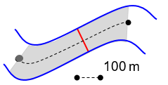
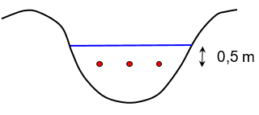
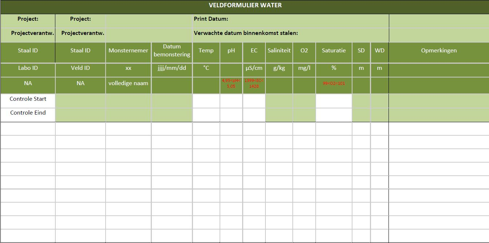

```{=html}
<!--
Instructies bij opmaak van het protocol:

Hieronder vind je de verschillende onderdelen van een protocol.
In de bijhorende losse `Rmd` bestanden vind je een beschrijving wat er bij elk onderdeel vermeld moet worden.
Het is in die bestanden dat je moet editeren.
Niet alle onderdelen zijn altijd van toepassing.
Laat in die gevallen de titel hoofdingen staan en vermeld expliciet "niet van toepassing".
-->
```
```{r setup, include=FALSE}
library(knitr)
opts_chunk$set(
  echo = FALSE,
  eval = TRUE,
  dpi = 300,
  fig.width = 150 / 25.4,
  fig.height = 100 / 25.4,
  out.width = "100%",
  warning = FALSE,
  error = TRUE,
  message = FALSE
)
library(dplyr)
library(purrr)
library(protocolhelper)
library(pander)
panderOptions("table.alignment.default", "left")
metadata <- rmarkdown::metadata
path_to_protocol <- get_path_to_protocol(metadata$protocol_code)
type <- get_protocol_type(metadata$protocol_code, auto_identifier = TRUE)
```

# Metadata {.unnumbered}

```{r metadata-table}
tibble(
  reviewers = metadata[["reviewers"]] |> paste(collapse = ", "),
  documentbeheerder = metadata[["file_manager"]],
  protocolcode = metadata[["protocol_code"]],
  versienummer = metadata[["version_number"]],
  taal = metadata[["language"]],
  projectnaam = metadata[["project_name"]]
) %>%
  kable()
```

```{r results="asis"}
sprintf("Controleer [deze tabel](../%s.html){target=\"_blank\"} om te zien of een meer recente versie beschikbaar is.", type) |> cat() # nolint
```

<!--chapter:end:index.Rmd-->

# Wijzigingen t.o.v. vorige versies

## [2024.08](../2024.08/index.html)

-   ...

```{=html}
<!--
Omschrijf hier welke wijzigingen er gebeurd zijn ten opzichte van de vorige versie. 
Vermeld bij elk versienummer, de reden van de wijziging en - wanneer relevant - een beknopte beschrijving van de wijziging.
Gesorteerd van recent naar oud. 

## [2020.02](../2020.02/index.html)

- Toevoeging van ontbrekende stap in het stappenplan
- Verbetering van schrijffouten

## [2020.01](../2020.01/index.html)

- Eerste versie van het protocol
-->
```

<!--chapter:end:NEWS.md-->

# Wijzigingen vorige versies

Eerste versie van dit protocol.

<!--chapter:end:01_wijzigingen_vorige_versies.Rmd-->

# Afhankelijkheden

Procedures waarnaar in deze procedure wordt verwezen:

-   SOP-005: Richtlijnen voor conserveren van watermonsters, chemische variabelen en praktische handelingen op terrein

-   SOP-007: Ontvangst en beheer van watermonsters door het laboratorium

-   SVP-112: Veiligheid in en rond water (in opmaak)

-   SVP-113: Bepaling doorzicht waterkolom oppervlaktewater op basis van de Secchi-diepte

-   SVP-114: Bemonstering waterkolom oppervlaktewater

-   SVP-115: Veldmeting abiotiek oppervlaktewater met behulp van een WTW Multi 3430 veldmeter

-   SVP-118: Bepaling stroomsnelheid (gepland)

-   SVP-015: Bioveiligheidsmaatregelen (in opmaak)

-   SPP-116: Abiotische staalname stilstaande oppervlaktewateren

Procedures die verwijzen naar deze procedure:

-   SPP-116: Abiotische staalname stilstaande oppervlaktewateren

<!--chapter:end:02_afhankelijkheden.Rmd-->

# Onderwerp

## Definities en afkortingen

**staalnamelocatie** of **steekproefeenheid:** Voor het project meetnetten natuurlijk milieu (zie verder) komt de steekproefeenheid voor waterlopen overeen met een 100 meter segment van de waterloop. Dit is het segment waarvan de abiotische karakterisatie wordt beoogd. Dit segment wordt aangeduid als het meest stroomafwaarts gelegen punt van het te bemonsteren 100 meter segment.

**staalnamepunt**: exacte plaats waar het waterstaal wordt genomen; dit is de meest geschikte dwarsdoorsnede van de waterloop binnen de staalnamelocatie (100 meter segment van de waterloop).

**oppervlaktewater**: al het permanent of op geregelde tijdstippen stilstaande of stromende water op het landoppervlak, aan de landzijde van de basislijn vanaf waar de breedte van de territoriale zee wordt gemeten (DIW 2003)

**staalnameformulier**: formulier waarop de veldmetingen, veldwaarnemingen en opmerkingen in verband met de staalname worden genoteerd

**waterdiepte**: verticale afstand tussen het wateroppervlak en het bodemoppervlak

zie definities en afkortingen van de deelprotocols (SVP-113, SVP-114, SVP-115)

## Doelstelling en toepassingsgebied

Deze procedure beschrijft de staalname van oppervlaktewater en de bepaling van enkele veldkenmerken in stromende wateren, met het oog op de bepaling van de fysisch-chemische toestand van de waterkolom. Dit projectprotocol is een overkoepelend protocol waarin voor specifieke werkzaamheden wordt verwezen naar andere protocollen. Dit protocol is specifiek ontworpen voor de monitoring in kader van de meetnetten natuurlijk milieu (Vanderhaeghe et al. 2020).

Deze gestandaardiseerde procedure kan toegepast worden in stromende wateren, gaande van bovenlopen tot zeer grote rivieren. Het protocol kan tevens worden toegepast in polderwaterlopen, grachten en kanalen. Voor stilstaande wateren verwijzen we naar het projectprotocol SPP-116.

<!--chapter:end:03_onderwerp.Rmd-->

# Benodigdheden

Tabel 1 geeft een overzicht van de benodigde apparatuur en materiaal voor het nemen van een waterstaal.

+-------------------------------------------------------------------------+-------------------------------------------------------------------+
| **algemene benodigdheden**                                              | **specifieke benodigdheden deelprotocollen**                      |
+-------------------------------------------------------------------------+-------------------------------------------------------------------+
| -   staalnameformulier (analoog of digitaal)                            | -   staalname-emmer (SVP-114, SVP-115)                            |
+-------------------------------------------------------------------------+-------------------------------------------------------------------+
| -   klembord, potlood en slijper                                        | -   maatbeker + reserve (SVP-114, SVP-115)                        |
+-------------------------------------------------------------------------+-------------------------------------------------------------------+
| -   laarzen, lieslaarzen, waadpak (site-afhankelijk)                    | -   spuiten en filters (SVP-114)                                  |
+-------------------------------------------------------------------------+-------------------------------------------------------------------+
| -   latex handschoenen (poederloos)                                     | -   recipiënten (SVP-114)                                         |
+-------------------------------------------------------------------------+-------------------------------------------------------------------+
| -   plooimeter                                                          | -   reserve recipiënt, hersluitbare zakjes (SVP-114)              |
+-------------------------------------------------------------------------+-------------------------------------------------------------------+
| -   fototoestel                                                         | -   koelbox met koelelementen (SVP-114)                           |
+-------------------------------------------------------------------------+-------------------------------------------------------------------+
| -   documentatie van het staalnamepunt om dit te kunnen lokaliseren     | -   Secchi-schijf (SVP-113)                                       |
+-------------------------------------------------------------------------+-------------------------------------------------------------------+
| -   relevante protocollen (SVP-113, SVP-114, SVP-115, SPP-117, SVP-118) | -   veldmeter type WTW Multi 3430 (SVP-115)                       |
+-------------------------------------------------------------------------+-------------------------------------------------------------------+
|                                                                         | -   stroomsnelheidsmeter (SVP-118)                                |
+-------------------------------------------------------------------------+-------------------------------------------------------------------+
|                                                                         | -   spuitfles met ultrapuur water (SVP-115)                       |
+-------------------------------------------------------------------------+-------------------------------------------------------------------+
|                                                                         | -   horizontale waterhapper, voorzien van een voldoende lang touw |
+-------------------------------------------------------------------------+-------------------------------------------------------------------+
|                                                                         | -   telescopische steel met maatbeker                             |
+-------------------------------------------------------------------------+-------------------------------------------------------------------+

: Tabel 1: Checklist benodigd veldmateriaal.

## Apparatuur

Zie apparatuur van de deelprotocols (SVP-115 voor de veldmeting abiotiek oppervlaktewater m.b.v. WTW Multi 3430 veldmeter en SVP-118 voor stroomsnelheid)

## Materiaal

Zie materiaal van de deelprotocols (SVP-113, SVP-114, SVP-115), aangevuld met:

-   horizontale waterhapper (bijvoorbeeld Friedinger, Van Dorn, ...) voorzien van nylonkoord of touw;

-   polyethyleen of polypropyleen maatbeker van 2 liter (+ reserve) voorzien van gietmondje en handvat;

-   telescopische steel + maatbeker.

## Reagentia en oplossingen

zie reagentia en oplossingen van de deelprotocols (SVP-114 en SVP-115)

<!--chapter:end:04_benodigdheden.Rmd-->

# Werkwijze

## Uitvoering

### Voorbereiding terreinwerk

-   Vooraf worden de XY-coördinaten van de staalnamelocatie ingevoerd in een standaard GPS of in een smartphone-applicatie. Dit is het meest stroomafwaarts gelegen punt van het te bemonsteren 100 meter segment van de waterloop, de steekproefeenheid voor het project meetnetten natuurlijk milieu.

-   In juni-september, tijdens een veldbezoek voorafgaand aan de meetcampagne, wordt vastgesteld of het doelhabitat (habitattype 3260) aanwezig is in het waterloopsegment (habitatdefinitie: zie Leyssen et al. 2020 en SVP-403).

### Lokaliseren en documenteren van staalnamepunt

-   navigeer met behulp van een standaard GPS (nauwkeurigheid ca. 3-5 m) naar de oever van de staalnamelocatie;

-   zoek binnen een afstand van 100 m stroomopwaarts naar een geschikte staalnamepunt en documenteer deze bij een eerste staalnamebezoek (coördinaten met standaard GPS, beschrijving en foto). Meanders worden hierbij best vermeden door slibophoping in de binnenbocht die kan opwarrelen, grote diepte in buitenbocht (veiligheid) en bijzondere stromings- en turbulentiepatronen in de meanders die kunnen leiden tot kwaliteitsverschillen in de genomen stalen. De voorkeur gaat dan uit naar een staalnamepunt, gelegen tussen 2 meanders op maximaal 100 meter van het oorspronkelijke coördinaten van de staalnamelocatie (figuur 1). De voorkeur wordt gegeven aan vegetatieloze of vegetatiearme zones in de waterloop. Verstoring van de planten leidt tot resuspensie van hierop aanwezig sediment, neerslag en aangroei en kan het staal contamineren.



### Secchi-diepte bepalen

zie deelprotocol (SVP-113)

De secchi-diepte wordt bij voorkeur bepaald in een vegetatieloze of vegetatiearme zone en in het midden van de waterloop. Indien de secchi-schijf door te sterke stroming niet loodrecht naar beneden kan worden gelaten, kan ze verzwaard worden. Indien de waterdiepte te groot is om de secchi-diepte al wadend te bepalen; kan dit vanop een nabijgelegen brug, of vanop een verankerde boot, gebeuren en dient dit gedocumenteerd te worden op het staalnameformulier in het opmerkingenveld. De waterdiepte waar de secchi-diepte werd bepaald, wordt eveneens genoteerd.

### Bepaling stroomsnelheid

zie deelprotocol (SVP-118): nog te ontwikkelen

De stroomsnelheid wordt op één plaats gemeten voor een algemene kwantitatieve karakterisatie van de stroomsnelheid. Gedetailleerde stroomsnelheidsbepalingen in verschillende segmenten in de dwarsdoorsnede van de waterlopen en op verschillende diepten zijn hier niet vereist.

De stroomsnelheid wordt gemeten op dezelfde plaats als de secchi-bepaling. Kies een nagenoeg recht stuk van de waterloop uit, met min of meer horizontale stroming (parallel met oeverlijn). Submerse vegetatie, grote stenen, vistrappen en andere obstakels moeten vermeden worden omdat dit turbulentie veroorzaakt.

De keuze van waterdiepte voor de stroomsnelheidsbepaling dient bij het ontwikkelen van het deelprotocol (SVP-118) verder uitgewerkt te worden, o.a. gebaseerd op Hartong & Termes (2009), Osté et al. (2013), Stone et al. (2012) en WVDEP (2018). Er zijn verschillende mogelijkheden:

-   De meting gebeurt op de helft van de waterdiepte. Bijv: bij een waterdiepte van 1 m, wordt de meting op 0,5 m diepte uitgevoerd.

-   Bij zeer diepe waterlopen wordt de stroomsnelheidsmeting op ca. 1 m diepte uitgevoerd, omdat de sonde niet dieper geplaatst kan worden (en uit veiligheidsoverwegingen).

-   De meting gebeurt steeds op 0,5 m diepte (vanaf het wateroppervlak gemeten), tenzij de waterloop minder dan 1 m diep is. Dan wordt de meting uitgevoerd op de helft van de waterdiepte.

### Bemonstering waterkolom en het vullen van de recipiënten

zie deelprotocols (SOP-005 en SVP-114); delen van onderstaande werkwijze kunnen later overgebracht worden naar SVP-114. Het mengstaal bestaat uit 3 deelstalen, die gesitueerd zijn langs het dwarsprofiel van de waterloop ter hoogte van het gekozen staalnamepunt (figuur 1) op ca. 0,5 meter waterdiepte (figuur 2). Indien de waterloop minder dan 1 meter diep is, wordt het staal genomen op de helft van de waterdiepte. Indien de waterbodem werd omgewoeld bij de bepaling van secchi-diepte of stroomsnelheid, wordt bij geringe stroming een meter stroomopwaarts gewaad voor deze staalname. Bij de staalname moet vermeden worden om waterbodem mee te bemonsteren, of om te woelen. Het staal wordt indien mogelijk genomen in een vegetatieloze of vegetatiearme zone en niet tussen helofyten. Verstoring van de planten leidt tot resuspensie van hierop aanwezig sediment, neerslag en aangroei en kan het staal contamineren. Desgevallend dient dit bij de opmerkingen op het staalnameformulier vermeld te worden (zie verder).



Om de deelstalen te kunnen nemen in stromend water op een diepte van 0,5 meter, zijn volgende methoden of materiaal aangewezen (in dalende voorkeur):

-   horizontale waterhapper (type Friedinger, Van Dorn, ...; zie bijlage 10 van Osté et al. 2013): het staal wordt al wadend genomen in de waterloop; eventueel verzwaard indien de waterstroming te sterk is

-   maatbeker (inhoud 2 l): het staal wordt met een maatbeker genomen al wadend in de waterloop. Hierbij keer je de maatbeker om, laat je deze in het water zakken tot ongeveer 50 cm diepte. Vervolgens keer je de maatbeker om, zodat je op deze diepte een staal kan nemen.

-   horizontale waterhapper vanop een brug: het staal wordt vanop een brug genomen op de 3 deellocaties van de dwarssectie. Dit wordt toegepast bij grote waterlopen, waar een brug aanwezig is en indien de waterdiepte te groot is om er door te waden en stalen te nemen. Omwoelen van de waterbodem tijdens de staalname dient vermeden te worden.

-   stok-methode (naar VMM 2020 en bijlage 10 van Osté et al. 2013): Indien de waterdiepte niet toelaat om veilig een staal al wadend te nemen kunnen de deelstalen genomen worden met behulp van een maatbeker of fles, bevestigd aan een (telescopische) stok. Indien mogelijk wordt geschept op de 3 plaatsen van de dwarssectie en wordt het staal voorzichtig verzameld in de emmer waarbij er gelet wordt op een minimale zuurstofinbreng.

De staalnamemethode wordt genoteerd op het veldformulier.

### Uitvoering veldmetingen

zie deelprotocol (SVP-115)

### Aflevering stalen aan het labo

De gekoeld getransporteerde stalen, inclusief een kopie van het staalnameformulier, worden zo snel mogelijk en zeker binnen de tijdspanne van 24 uur na het nemen van het eerste staal van de dag binnengebracht bij het labo. In het labo worden de stalen, in afwachting van verdere analyse, in de koelkamer bewaard (zie SVP-007).

### Digitalisatie van de gegevens op het staalnameformulier

Na de staalname worden de gegevens ingevoerd in het digitale staalnameformulier gedeeld door het Labo via Google Drive.

## Registratie en bewaring van resultaten

### Registratie van resultaten: staalnameformulier (naar VMM 2020)

Het staalnameformulier kan ingedeeld worden in 3 onderdelen (zie google sheet Bijlage 1):

1.  Kopgegevens: labocode (vooraf ingevuld), code staalnamepunt, staalnemer, datum, uur

-   Reden geen staalname: werken waterloop; staalnamepunt onbereikbaar; onvoldoende watervoerend/-houdend; ijsvorming (omschrijving: zie hoger)

-   Staalnamepunt: in waterloop (afgekort WL); vanop brug/duiker; vanop steiger

-   Staalnamemethode: horizontale waterhapper; maatbeker; telescopische stok

-   Weersomstandigheden: hevige neerslag, geen neerslag, ...

De staalnamepunt en staalnamemethode wordt genoteerd zodat toekomstige staalnames zoveel mogelijk op dezelfde wijze gebeuren en de meetresultaten vergelijkbaar zijn.

2.  Veldmetingen: temperatuur (°C), pH, EC (µS/cm), saliniteit (g/kg), O~2~ (mg/l), O~2~-saturatie (%), secchi-diepte (SD, m), waterdiepte (WD, m), stroomsnelheid (ss, m/s)

3.  Uitzonderlijke omstandigheden

Deze veldwaarnemingen omvatten waarnemingen ter plaatse, of in de onmiddellijke omgeving van het staalnamepunt, van tijdelijke fenomenen waarvoor een verband met de abiotische toestand van de onderzochte waterloop vermoed kan worden. Het gaat om vaststellingen die afwijkend zijn van de normale omstandigheden. Omdat deze mede de analyseresultaten kunnen verklaren is het van belang dat ze zo uniform mogelijk en kwaliteitsvol worden ingevuld. Op het staalnameformulier wordt bij veldwaarnemingen onderstaande onderlijnde uitspraak genoteerd bij 'uitzonderlijke veldwaarnemingen'. Onderstaande lijst kan op een klembord gekleefd worden als geheugensteun.

-   zichtbare verontreiniging van wateroppervlak of waterkolom:

    -   [Maaisel]{.underline} / drijvende plantenresten: op het wateroppervlak drijft er maaisel of zijn er drijvende plantenresten aanwezig.

    -   [Dode fauna]{.underline}: dode fauna aanwezig (vis, eend, ...).

    -   [Olie]{.underline}: kleurige film (kleurschakering met rood, paars, blauw en geel) op het wateroppervlak. Opgelet: bacteriën kunnen eveneens een dunne film op het water vormen. Bij verstoring van deze film (bv door de inworp van een steen) zal deze laag echter breken in de vorm van barstjes, terwijl een oliefilm zich bijna onmiddellijk terug sluit.

    -   [Vast afval]{.underline}: zoals bv. flessen, banden, fietsen, plastic zakken, blikjes,... .

    -   [Schuim]{.underline}: schuimvorming ten gevolge van algenbloei of tensio-actief schuim (veroorzaakt door detergenten).

    -   [Algenbloei]{.underline}: het water heeft meestal een groene kleur (, in de duidelijkste gevallen te omschrijven als 'erwtensoep'; kan ook gepaard gaan met bv. een bruine, blauwe, paarse of rode kleur.

    -   [Bloei watervlooi]{.underline}en: dit kan het water rood kleuren. Het waterstaal bevat veel zoöplankton als men ziet dat de rode massa kleine beweeglijke organismen zijn.

    -   [Gasontwikkeling]{.underline}: aan het wateroppervlak ziet men kleine blaasjes (gasbellen) die openbarsten.

    -   [Vlokken]{.underline}: samengekoekt materiaal (groot of klein) met onregelmatige structuur in of op de waterkolom (meestal wit, grijs of zwart).

    -   [Rioolschimmel]{.underline}: grijze tot bruine slierten (schimmels) op wortels, stenen of de bodem.

    -   [Abundante plantengroei]{.underline}, waardoor de staalname bemoeilijkt wordt.

-   Andere opmerkingen: wordt ingevuld indien geen van de overige codes van toepassing is.

### Bewaring van resultaten

-   Voor elk staalnamepunt wordt ter plaatse een analoog staalnameformulier ingevuld (zie hoger). Afwijkingen van de beschreven werkwijze voor het nemen van een schepstaal worden eveneens genoteerd.

-   De meetresultaten, vermeld op het staalnameformulier, worden zo snel mogelijk gedigitaliseerd en gedeeld met het labo.

-   De laboresultaten worden geregistreerd in LIMS en worden ontsloten via het LIMS-datawarehouse.

### Opslag van foto's

Opslag van foto's op google drive met aanduiding van opnamedatum, code staalnamepunt en naam waterloop (volgens de Vlaamse Hydrografische Atlas; [[https://www.vmm.be/data/vlaamse-hydrografische-atlas]{.underline}](https://www.vmm.be/data/vlaamse-hydrografische-atlas)).

<!--chapter:end:05_werkwijze.Rmd-->

# Kwaliteitszorg

zie kwaliteitszorg van deelprotocols (SVP-113, SVP-114, SVP-115)

Neem steeds alle relevante protocollen mee in het veld en kijk voor het vertrek steeds na of al het materiaal aanwezig is en of op batterijen werkende toestellen voldoende zijn opgeladen. De checklist van het veldmateriaal staat in Tabel 1.

Het staalnameformulier wordt volledig ingevuld. Net na de staalname wordt gecontroleerd of alle velden van het staalnameformulier werden ingevuld.

Nadat alle metingen van een veldseizoen zijn geregistreerd en beschikbaar zijn in het LIMS-datawarehouse, worden via query's, kruistabellen, e.d. kwaliteitscontroles uitgevoerd. Bijvoorbeeld: Zijn voor alle gemeten staalnamepunten gegevens beschikbaar? Zijn alle codes van de staalnamepunten correct gespeld? Zijn er ontbrekende (veld)metingen? Detecteren van uitschieters, ...

<!--chapter:end:06_kwaliteitszorg.Rmd-->

# Veiligheid

Tijdens het veldwerk gelden volgende veiligheidsregels:

-   algemene veiligheidsregels rond het werken in en nabij water (SVP-112);

-   bioveiligheidsmaatregelen voor het voorkomen van de verspreiding van invasieve exoten (SVP-015);

-   veiligheidsvoorschriften van de deelprotocols (SVP-114, SVP-115).

Voorzichtigheid is ten zeerste geboden bij diepe en snelstromende waterlopen, bij weke waterbodem en bij gladde taluds. In deze omstandigheden kan een alternatieve monsternametechniek toegepast worden (zie 6.1.5). Gebruik een veiligheidsstouw of reddingsvest wanneer de situatie dit vereist.

Neem steeds een hark of stevige stok mee als steun bij het doorwaden van de waterloop. Je kan er de waterdiepte mee peilen voor je in de waterloop gaat; je kan deze gebruiken om je evenwicht te behouden. Bovendien kan het een hulp zijn om een steile oever te beklimmen.

Tijdens een staalname in water draagt men waterdichte handschoenen; na de opname wast men de handen met ontsmettende, fosfaatvrije zeep om het risico op besmetting te beperken.

De staalnemer beschikt steeds over een GSM en een lijst van nuttige telefoonnummers.

<!--chapter:end:07_veiligheid.Rmd-->

# Referenties

Bijkerk R. (red) (2014) Handboek Hydrobiologie. Biologisch onderzoek voor de ecologische beoordeling van Nederlandse zoete en brakke oppervlaktewateren. Deels aangepaste versie (Rapport 2014 - 02). Stichting Toegepast Onderzoek Waterbeheer, Amersfoort.

DIW (2003). Decreet Integraal Waterbeleid van 18 juli 2003 (B.S. 5/12/2003). [[https://navigator.emis.vito.be/mijn-navigator?woId=75697]{.underline}](https://navigator.emis.vito.be/mijn-navigator?woId=75697)

Hartong & Termes (2009). Handboek debietmeten in open waterlopen. STOWA, Utrecht.

Leyssen A., Smeekens V., Denys L. (2020). Indicatieve situering van het Natura 2000 habitattype 3260. Submontane en laaglandrivieren met vegetaties behorend tot het *Ranunculion fluitantis* en het *Callitricho-Batrachion*. Uitgave 2020 (versie 1.7). Rapporten van het Instituut voor Natuur- en Bosonderzoek 2020 (34). Instituut voor Natuur- en Bosonderzoek, Brussel.

Osté A.J., de Groot B. van Dam O (2013). Handboek hydromorfologie 2.0. Afleiding en beoordeling hydromorfologische parameters Kaderrichtlijn Water. Advies- en ingenieursbureau RPS in opdracht van Directoraat-Generaal Rijkswaterdienst, Delft.

Stone, M.L., Rasmussen, T.J., Bennett, T.J., Poulton, B.C., and Ziegler, A.C. (2012). Protocols for collection of streamflow, water-quality, streambed-sediment, periphyton, macroinvertebrate, fish, and habitat data to describe stream quality for the Hydrobiological Monitoring Program. U.S. Geological Survey, Kansas.

Vanderhaeghe F., Adriaens D., Denys L., Cools N., Jansen I., Herr C., Verstraeten A., Raman M., Wouters J.,Van Calster H. Westra T., Onkelinx T., Van Daele T., Oosterlynck P., Leyssen A., Wackenier M., De Becker P., Piesschaert F., Desmet P., Louette G., Quataert P., Vandenabeele, M.A., Van Elegem B. (2020). Ontwikkeling en implementatie meetnetten natuurlijk milieu. In: Programmatorische aanpak stikstof -- platform passende beoordeling. Onderzoek, monitoring, methodologie-ontwikkeling en data-ontsluiting door het Instituut voor Natuur- en Bosonderzoek (PAS-PPB periode 2015-2019). Hoffmann M. & Gerald Louette G. (eds.). Rapporten van het Instituut voor Natuur- en Bosonderzoek (11), Brussel: blz. 106-116.

VMM (2020). Procedure voor de monsterneming en verdeling van oppervlaktewater t.b.v. fysisch-chemisch onderzoek d.m.v. een schepmonster. VMM/WAT/GP/3.105; uitgave 15. Vlaamse Milieumaatschappij, Aalst.

West Virginia Department of Environmental Protection (2018). Watershed assessment branch. Field sampling. Standard Operating Procedures. West Virginia Department of Environmental Protection, Charleston.

<!--chapter:end:08_referenties.Rmd-->

```{r, results="asis"}
if (exists("params")) {
  if (!is.null(params$dependencies)) {
    mdfiles <- paste0(map_chr(params$dependencies, "protocol_code"),
                      "-",
                      map_chr(params$dependencies, "version_number"),
                      ".md")
    child_docs <- file.path(map_chr(params$dependencies, "version_number"),
                            mdfiles)

    child_docs <- child_docs[map_lgl(params$dependencies, "appendix")]

    if (length(child_docs) > 0) {
      res <- map(child_docs, knit_child, quiet = TRUE)
      cat(
        c("# (PART) Subprotocols {.unnumbered}", "", unlist(res)), sep = "\n")
    }
  }
}
```

<!--chapter:end:09_subprotocols.Rmd-->

# BIJLAGE

Bijlage 1: Voorbeeld staalnameformulier



<!--chapter:end:10_bijlage.Rmd-->

